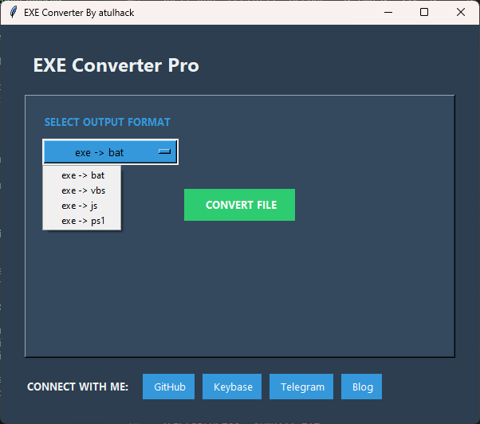

<div align="center">
  
</div>

---

### 🔥 About Me
```python
class CyberSecurityExpert:
    def __init__(self):
        self.name = "[atul hack]"
        self.role = "Security Researcher | Malware Developer"
        self.skills = {
            "Offensive Security": ["Exploit Dev 'Web' ", "Evasion"],
            "Malware": ["Loader Dev", "AV/EDR Bypass", "Persistence"],
            "Tools": ["C2 Frameworks", "Custom Implants",]
        }
        
    def motto(self):
        return "Turning vulnerabilities into opportunities"
```

---

### 🛠️ EXE Converter Pro
<div align="center">
  
</div>
 
**Key Features:**
- 🛡️ Secure executable transformation
- 🔄 Multiple output formats (BAT/VBS/JS/PS1)
- 🎨 Dark mode UI
- 🔗 Integrated social connectivity

```bash
# Run with
python exe_converter.py
```

---

### 🚀 My Tech Stack
<p align="center">
  
</p>

---

### 📊 GitHub Analytics
<div align="center">
  
  
</div>

---

### 🏆 Achievements
- Developed custom malware
- Contributed to open-source security tools
- Sometimes You Know

---

### 📫 Connect With Me
<p align="center">
  <a href="https://twitter.com/atulhack">
    
  </a>
  <a href="https://keybase.io/atulhack">
    
  </a>
  <a href="https://t.me/atulhack">
    
  </a>
  <a href="mailto:atulhack@proton.me">
    
  </a>
</p>

---

<div align="center">
  
</div>
